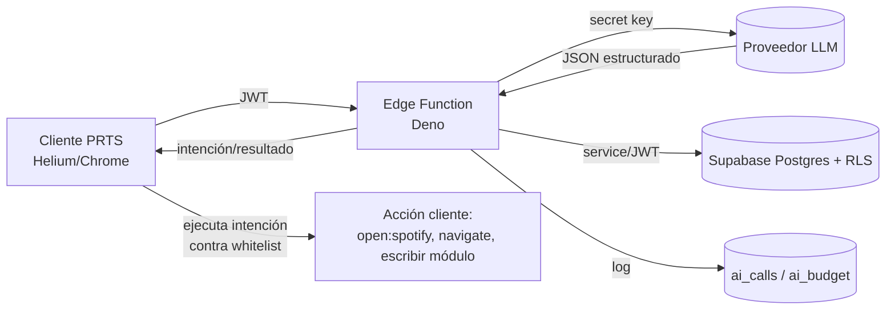
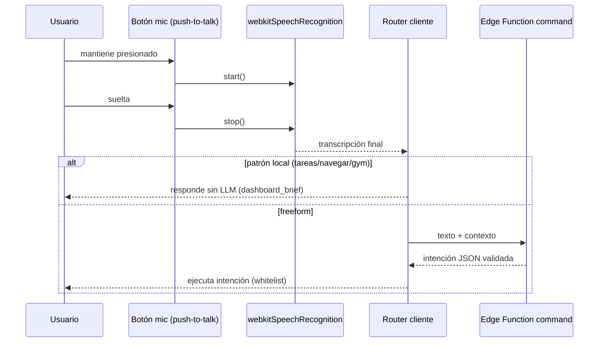

# PRTS · Fase 4 — Capa de IA ("Jarvis")
### Documento de arquitectura y plan de implementación

| | |
|---|---|
| **Estado** | Propuesta — pendiente de aprobación |
| **Fecha** | 2026-06-11 |
| **Autor** | Sylft (con asistencia) |
| **Alcance** | Capa de IA sobre los módulos existentes de PRTS |
| **Precede a** | Fase 5 (académico) / Fase 6 según `Documentacion_Sistema_PRTS.docx` |
| **Stack base** | HTML/JS vanilla + Supabase (Postgres, Auth, RLS) + Vercel (estático) |

---

## 1. Contexto y objetivos

PRTS ya tiene sus módulos operativos (Gym, Dieta, Apuntes, Tareas, Proyectos, Semana, Dashboard) escribiendo a Supabase con RLS. La Fase 4 añade una **capa de IA opcional** que:

1. Procesa la **captura universal** (`inbox_entries`) y completa registros en el módulo correcto.
2. Genera un **briefing diario** accionable (≤5 líneas) antes de las 11:00.
3. Interpreta **comandos de voz/texto** (protocolos de inicio, acciones de apertura) restringidos al escritorio.
4. Lo hace con **costo controlado, prompts versionados y degradación total**: si la IA falla o se apaga, PRTS sigue funcionando 100 % manual.

> **Principio rector:** la IA es una *mejora*, nunca una *dependencia*. Cada función de IA tiene su camino manual ya construido (p. ej. el dashboard ya cae a `frasesBriefing()` determinista si la IA no responde).

---

## 2. Restricciones acordadas (Fase 4)

| Tema | Decisión |
|---|---|
| **Voz** | Solo en **computadora de escritorio**, navegadores **Helium o Chrome** (ambos Chromium → `webkitSpeechRecognition` disponible). |
| **Interacción de voz** | **Push-to-talk** (mantener presionado para hablar). Es la interacción principal y la única garantizada. |
| **Wake word "hey Siri"** | **Fuera de alcance.** Una PWA no tiene micrófono en segundo plano fiable; además la voz queda en escritorio/primer plano. Se documenta como posible extensión futura (foreground listener con Picovoice Porcupine), no se implementa ahora. |
| **Móvil** | Sin voz. La captura sigue siendo por texto en el móvil; el botón de voz se oculta o deshabilita fuera de escritorio Chromium. |

---

## 3. Decisión arquitectónica central — backend de confianza

**Problema:** llamar a un LLM requiere una API key secreta. En un frontend estático cualquiera la extrae del bundle. Por tanto la key **no puede vivir en el cliente**.

**Decisión:** introducir un backend mínimo de confianza con **Supabase Edge Functions** (Deno/TypeScript). Es el encaje natural: ya usas Supabase, las functions comparten Auth/JWT, la key vive en los *secrets* de Supabase y ahí centralizamos llamadas al modelo, validación, logging de costos, reintentos y degradación.

**Alternativas descartadas:** key en cliente (inseguro); un servidor Node propio en Vercel (más superficie que mantener; las Edge Functions ya vienen con Supabase y comparten el JWT del usuario).

### Flujo general



> **La IA nunca ejecuta efectos secundarios.** Devuelve **intenciones** en JSON validado; el **cliente** las ejecuta contra una lista blanca. Esto mantiene el control, la seguridad y la posibilidad de confirmar/deshacer.

---

## 4. Principios de diseño

1. **Degradación primero.** Toda llamada IA se envuelve; ante fallo final → `status='error'`, retorna `null`, y el cliente usa su camino manual. Circuit breaker si hay fallos repetidos.
2. **La IA propone, el humano dispone (al inicio).** Durante el mes de validación, las escrituras a módulos pasan por confirmación. Cuando la confianza medida sea alta, se permiten acciones automáticas por tipo.
3. **Intenciones, no ejecución.** Vocabulario de acciones cerrado y validado con JSON schema + Zod.
4. **Costo observable y con tope.** Cada llamada registra tokens y costo; corte mensual; si se supera el presupuesto, la IA se degrada sola a manual.
5. **Contexto mínimo suficiente.** Se inyecta `dashboard_brief` + inbox reciente, no la base entera. Presupuesto de tokens por agente.
6. **Privacidad consciente.** Es tu dato personal; aun así, define qué campos se mandan al modelo (los apuntes pueden ser sensibles). Nada de claves ni PII innecesaria en el prompt.
7. **Reversibilidad.** Cada escritura de IA guarda su origen (`inbox_entries.result`, `ai_calls.ref_*`) para poder deshacer.

---

## 5. Agentes

Cada "agente" = una Edge Function (o handler) con: propósito, contexto de entrada, **schema de salida**, modelo, disparador y degradación.

### 5.1 Agente `inbox` — clasificador de captura universal

- **Disparador:** botón "procesar" en el dashboard y/o cron cada N min sobre `inbox_entries` pendientes.
- **Entrada:** `raw_text` + contexto ligero (módulos disponibles, materias/orígenes conocidos, fecha MX).
- **Salida (JSON estructurado, *tool calling*):**

```json
{
  "module": "tareas|dieta|gym|apuntes|proyectos|semana|recordatorio|desconocido",
  "action": "create|append|log|none",
  "payload": { "...campos del módulo destino..." },
  "confidence": 0.0,
  "summary": "qué entendió, en una línea"
}
```

- **Aplicación:** si `confidence ≥ 0.8` → tarjeta "PRTS interpretó esto como… [Confirmar] [Editar] [Descartar]". Nunca escribe en silencio en Fase 4. Al confirmar, el cliente inserta en la tabla destino y marca `inbox_entries.status='procesada'`, guardando en `result` el `{module, target_id, summary}`.
- **Modelo:** tier económico (clasificación simple). **Degradación:** la entrada permanece `pendiente`; el usuario la procesa a mano como hoy.

### 5.2 Agente `briefing` — resumen diario

- **Disparador:** **pre-generación programada** (~10:30 MX, antes de las 11:00) + botón "regenerar".
- **Entrada:** salida de `dashboard_brief()` (ya existe) — datos estructurados del día.
- **Salida:** texto plano, **máx. 5 líneas, accionable** (qué hacer hoy, no descripción). Se guarda en `daily_briefings`.
- **Lectura del cliente:** el dashboard lee `daily_briefings` del día → texto instantáneo, **sin** llamada al LLM por apertura. Costo: ~1 llamada/día.
- **Degradación:** si no hay briefing de IA para hoy → el dashboard usa `frasesBriefing(dashboard_brief)` determinista (ya implementado).

### 5.3 Agente `command` — intérprete de comandos (voz/texto)

- **Disparador:** transcripción de push-to-talk o texto del usuario ("Hola PRTS, …").
- **Enrutado híbrido (importante para costo/latencia):**
  - **Intenciones locales** resueltas **sin LLM** por coincidencia de patrón: "resume mis tareas", "¿qué toca hoy en el gym?", "abre apuntes" → se responden con `dashboard_brief`/navegación directa.
  - Solo lo **freeform** o ambiguo va al LLM, que devuelve una **intención** del vocabulario cerrado (§7).
- **Salida (JSON):**

```json
{
  "intent": "open|navigate|summary|create_task|log_weight|weather|unknown",
  "params": { "target": "spotify", "deep_link": "spotify:playlist:..." },
  "speak": "respuesta breve para mostrar/leer",
  "confidence": 0.0
}
```

- **Degradación:** si falla, se muestra la transcripción cruda como captura normal (no se pierde nada).

### 5.4 Agente `insights` — *(diferido dentro de Fase 4)*

Patrones y correlaciones (adherencia↔peso, estancamientos, carga semanal). **Requiere ~1 mes de datos reales** (según estrategia acordada). Se especifica después de 4.0–4.2.

---

## 6. Modelo de datos nuevo

Migración sugerida `supabase/migrations/20260611000008_ai_layer.sql`. Mantiene el estilo existente (`user_id default auth.uid()`, RLS `owner_all`, TZ `America/Mexico_City`).

```sql
-- Registro de llamadas a la IA (tokens, costo, estado) para corte mensual y degradación
create table public.ai_calls (
  id uuid primary key default gen_random_uuid(),
  user_id uuid not null references auth.users(id) on delete cascade,  -- la Edge Function lo setea explícito
  agent text not null,                       -- 'inbox' | 'briefing' | 'command' | 'insights'
  prompt_version text not null,              -- p. ej. 'inbox.v1'
  model text not null,
  input_tokens int not null default 0,
  output_tokens int not null default 0,
  cost_usd numeric(10,6) not null default 0,
  latency_ms int,
  status text not null default 'ok' check (status in ('ok','error','degraded')),
  error text,
  ref_table text,                            -- a qué afectó (p. ej. 'inbox_entries')
  ref_id uuid,
  created_at timestamptz not null default now()
);
create index idx_ai_calls_month on public.ai_calls (user_id, created_at desc);

-- Briefing diario pre-generado (lectura instantánea en el dashboard)
create table public.daily_briefings (
  id uuid primary key default gen_random_uuid(),
  user_id uuid not null references auth.users(id) on delete cascade,
  brief_date date not null default (now() at time zone 'America/Mexico_City')::date,
  text text not null,
  model text,
  prompt_version text,
  source jsonb,                              -- el dashboard_brief usado, para auditoría
  created_at timestamptz not null default now(),
  unique (user_id, brief_date)
);

-- Presupuesto mensual de IA (tope de gasto → degradación automática)
create table public.ai_settings (
  user_id uuid primary key references auth.users(id) on delete cascade,
  monthly_cap_usd numeric(8,2) not null default 5.00,
  enabled boolean not null default true
);

-- RLS
alter table public.ai_calls       enable row level security;
alter table public.daily_briefings enable row level security;
alter table public.ai_settings     enable row level security;
create policy "owner_all" on public.ai_calls        for all using (auth.uid() = user_id) with check (auth.uid() = user_id);
create policy "owner_all" on public.daily_briefings for all using (auth.uid() = user_id) with check (auth.uid() = user_id);
create policy "owner_all" on public.ai_settings      for all using (auth.uid() = user_id) with check (auth.uid() = user_id);

-- Gasto del mes en curso (para el tope y un futuro panel de costos)
create or replace function public.ai_spend_month()
returns numeric language sql stable as $$
  select coalesce(sum(cost_usd), 0)
  from public.ai_calls
  where user_id = auth.uid()
    and created_at >= date_trunc('month', now() at time zone 'America/Mexico_City');
$$;
grant execute on function public.ai_spend_month() to authenticated;
```

`inbox_entries` ya tiene `result jsonb` y `status` reservados; no requiere cambios (opcionalmente `confidence numeric` si quieres filtrarlo en SQL).

> **Nota RLS crítica:** las Edge Functions suelen usar la `service_role` key, que **salta RLS** y deja `auth.uid()` en `null`. Por eso `ai_calls.user_id` **no** usa `default auth.uid()`: la función debe escribir el `user_id` explícitamente (tomado del JWT del usuario). Alternativa más estricta: que la function actúe con el JWT del usuario (no service role) y deja que RLS la proteja.

---

## 7. Contrato de acciones (intenciones)

Vocabulario **cerrado**. El cliente tiene un ejecutor con `switch` sobre `intent`; cualquier intención fuera de la lista se ignora (nunca `eval`).

| `intent` | `params` | Ejecución en cliente |
|---|---|---|
| `open` | `{ target, deep_link }` | abre deep link permitido (p. ej. `spotify:playlist:…`) |
| `navigate` | `{ view }` | cambia de vista/hash (`#tareas`, `gym.html`, …) |
| `summary` | `{ scope: 'tareas'\|'dia'\|'gym' }` | renderiza resumen desde `dashboard_brief` |
| `create_task` | `{ title, origin, priority, deadline }` | inserta en `tasks` (con confirmación) |
| `log_weight` | `{ weight_kg, date }` | upsert en `body_weights` (con confirmación) |
| `weather` | `{ location? }` | consulta clima vía Edge Function + permiso de ubicación |
| `unknown` | — | muestra transcripción como captura |

**Lista blanca de deep links** (constante en cliente): `spotify:`, `https://open.spotify.com/`, rutas internas de PRTS. Todo lo demás se rechaza.

Ejemplo: *"pon música para estudiar"* → `{ intent:"open", params:{ target:"spotify", deep_link:"spotify:playlist:<id-preset>" }, speak:"Abriendo tu playlist de estudio" }`.

---

## 8. Voz — push-to-talk (escritorio Chromium)

- **Tecnología:** Web Speech API (`window.webkitSpeechRecognition`), `lang = 'es-MX'`, `interimResults = true` para transcripción en vivo, `continuous = false`.
- **Gate de capacidad:** habilitar solo si `('webkitSpeechRecognition' in window)` **y** el dispositivo es escritorio. En móvil/otros → ocultar el botón o mostrar nota "voz disponible en escritorio".
- **UX (reaprovecha el botón `#cap-voz` ya presente):**
  - `pointerdown` en el micrófono → `recognition.start()`, indicador "escuchando…".
  - `pointerup` → `recognition.stop()` → transcripción final.
  - Enrutado de la transcripción:
    - Si empieza con muletilla de mando (`"PRTS, …"`, `"hola PRTS"`) o matchea gramática local → **Agente `command`**.
    - Si no → se vuelca al input de **captura universal** (dictado) y sigue el flujo de inbox.
- **Degradación:** sin reconocimiento → el botón vuelve a su estado de captura por texto. Nada se rompe.



---

## 9. Briefing diario — pre-generación programada

- **Cuándo:** ~10:30 MX. Opciones: `pg_cron` + `pg_net` (`net.http_post`) llamando a la Edge Function `generate-briefing`, o la programación nativa de Supabase. Idempotente por `unique(user_id, brief_date)`.
- **Qué:** lee `dashboard_brief()`, lo pasa al modelo con el prompt `briefing.vN`, guarda 5 líneas en `daily_briefings`.
- **Lectura:** el dashboard intenta `daily_briefings` de hoy; si no existe, `frasesBriefing()` determinista. Cero latencia percibida.

---

## 10. Infraestructura transversal

### 10.1 Prompts versionados en Git
Viven en el repo, se despliegan con la función:
```
supabase/functions/_shared/prompts/
  inbox.v1.md
  briefing.v1.md
  command.v1.md
```
Cada archivo lleva cabecera `version: inbox.v1`. **Cada llamada registra `prompt_version`** en `ai_calls` → permite comparar acierto entre versiones y hacer rollback.

### 10.2 Schemas por agente
```
supabase/functions/_shared/schemas.ts   // Zod + JSON schema por agente
```
Salida del modelo vía *tool calling / structured outputs* → se valida con Zod antes de aplicar. Si no valida → 1 reintento; si vuelve a fallar → degradación.

### 10.3 Inyección de contexto
- `inbox`: `raw_text` + catálogo de módulos/orígenes/materias + fecha MX.
- `briefing`: solo `dashboard_brief()`.
- `command`: utterance + estado mínimo (vista actual, tareas urgentes).
- Presupuesto de tokens por agente; nunca volcar tablas completas.

### 10.4 Logging de tokens/costos + corte mensual
- Tras cada llamada, leer `usage` de la respuesta del proveedor → `input_tokens`, `output_tokens`.
- `cost_usd = tokens × tarifa_vigente` (tarifa en constante de config; **verificar precios y modelo vigentes al implementar** — cambian).
- Corte mensual con `ai_spend_month()`. Panel de costos opcional como artefacto/seguimiento.

### 10.5 Reintentos + degradación
- Backoff exponencial en `429`/`5xx` (p. ej. 3 intentos: 0.5s, 1.5s, 4s).
- **Circuit breaker:** si N fallos consecutivos en una ventana → marcar IA "degradada" temporalmente, no intentar y servir manual.
- Tope de presupuesto superado → `enabled=false` efectivo hasta el siguiente mes.

### 10.6 Seguridad
- Key del LLM en **Supabase secrets** (`supabase secrets set`).
- Preferir actuar con el **JWT del usuario** (RLS protege) y usar service role solo donde sea imprescindible, siempre filtrando por `user_id`.
- Deep links y acciones: **whitelist**, nunca ejecutar strings arbitrarios.

### 10.7 Evaluación / regresión
- Carpeta `ai/evals/` con ejemplos `captura → parse esperado`. Antes de subir un `prompt.vN+1`, correr el set y comparar aciertos. Liga directa con el versionado de prompts.

---

## 11. Estructura de carpetas propuesta

```
mi-app-PRTS/
├─ app/                      # frontend actual (sin cambios de stack)
│  └─ ai/
│     ├─ actions.js          # ejecutor de intenciones (whitelist) + deep links
│     └─ voice.js            # push-to-talk (gate de capacidad)
├─ supabase/
│  ├─ migrations/
│  │  └─ 20260611000008_ai_layer.sql
│  └─ functions/
│     ├─ _shared/
│     │  ├─ llm.ts           # cliente LLM + retry + circuit breaker + logging
│     │  ├─ schemas.ts       # Zod por agente
│     │  └─ prompts/         # *.vN.md versionados
│     ├─ process-inbox/index.ts
│     ├─ generate-briefing/index.ts
│     └─ interpret-command/index.ts
├─ ai/
│  └─ evals/                 # casos de regresión
└─ docs/
   └─ Fase4_Arquitectura_IA.md   # este documento
```

---

## 12. Plan de implementación por fases de riesgo

Coherente con tu filosofía "un módulo a la vez, uso real antes de avanzar". Riesgo creciente:

| Sub-fase | Entrega | Riesgo | Depende de |
|---|---|---|---|
| **4.0** | Backend mínimo (`_shared/llm.ts`), tablas, secrets, `ai_calls`, **briefing diario** (solo lectura) | Bajo | migración 0008 |
| **4.1** | **Inbox sugerir-y-confirmar** (tarjeta de confirmación) | Medio | 4.0 |
| **4.2** | **Voz push-to-talk** + `interpret-command` + acciones (`open:spotify`, navegar, resumir) | Medio | 4.0 |
| **4.3** | **Acciones automáticas** por tipo de alta confianza (sin confirmar) | Alto | datos de acierto de 4.1 |
| **4.4** | **Insights** (correlaciones/patrones) | Medio | ~1 mes de datos |
| **(futuro)** | Wake-word foreground (Porcupine) — opcional, fuera de Fase 4 | — | — |

Briefing e inbox **pueden arrancar ya**: casi no dependen de historial. Los insights sí esperan el mes de datos.

---

## 13. Pasos operativos (cuando se implemente)

> Git y `supabase` los corres tú en PowerShell (el sandbox no escribe `.git` de forma fiable).

```powershell
# 1. Migración
supabase db push

# 2. Secret de la key del LLM (nombre de ejemplo)
supabase secrets set LLM_API_KEY=...

# 3. Desplegar funciones
supabase functions deploy process-inbox
supabase functions deploy generate-briefing
supabase functions deploy interpret-command

# 4. Programar el briefing (~10:30 MX) vía pg_cron o cron de Supabase

# 5. Frontend
git add -A
git commit -m "Fase 4.0: capa IA — backend, briefing diario, logging de costos"
git push
```

---

## 14. Riesgos y mitigaciones

| Riesgo | Mitigación |
|---|---|
| Key filtrada | Solo en Edge Functions/secrets; nunca en el bundle. |
| Costo descontrolado | `ai_calls` + tope mensual + degradación automática + modelo económico + enrutado local sin LLM. |
| IA caída rompe la app | Degradación total: todo tiene camino manual; circuit breaker. |
| JSON inválido del modelo | *Tool calling* + validación Zod + reintento. |
| Voz no disponible | Gate de capacidad; push-to-talk como base; fallback a texto. |
| Escrituras erróneas de IA | Confirmación humana en 4.1; reversibilidad vía `result`/`ai_calls.ref_*`. |
| RLS evadido por service role | `user_id` explícito o actuar con JWT del usuario. |
| Datos sensibles al proveedor | Inyección de contexto mínima y consciente. |

---

## 15. Decisiones abiertas

1. **Proveedor/modelo** del LLM y tarifa para `cost_usd` (verificar vigentes al implementar).
2. **API de clima** y manejo del permiso de ubicación en escritorio.
3. **Mecanismo de cron** definitivo (pg_cron+pg_net vs cron nativo de Supabase).
4. **Umbral de confianza** para pasar de "confirmar" a "automático" en 4.3 (definir con datos de 4.1).
5. ¿Las playlists de "estudio/foco" se definen como **presets** fijos o se eligen vía API de Spotify?
