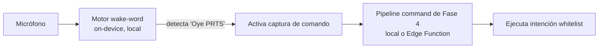
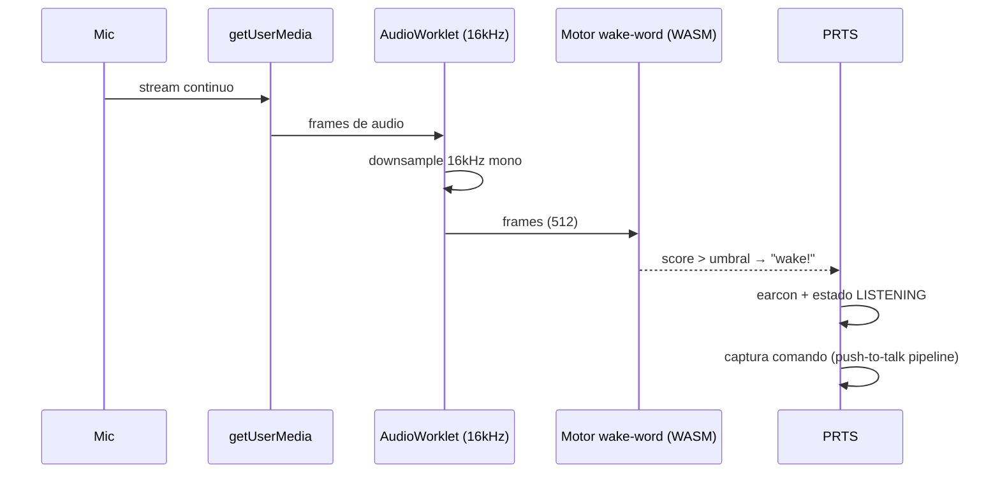

# PRTS · Fase 5 — Wake-word "siempre encendido"
### Consideraciones de arquitectura previas a la implementación

| | |
|---|---|
| **Estado** | Exploración — recopilación de consideraciones (no aprobado) |
| **Fecha** | 2026-06-11 |
| **Depende de** | Fase 4 (capa IA: agente `command`, push-to-talk, intenciones whitelist) |
| **Alcance de voz** | Escritorio, navegadores Chromium (Helium/Chrome) |
| **Objetivo** | Activación por palabra clave ("Oye PRTS") sin tocar el teclado/ratón |

> Este documento **no** propone construir todavía; reúne todo lo que hay que considerar y decidir antes de comprometer la Fase 5. El push-to-talk de la Fase 4 sigue siendo el camino base y la red de seguridad.

---

## 1. Lo primero: qué significa "siempre encendido" de verdad

Hay que ser honesto con el alcance, porque condiciona toda la arquitectura. "Siempre encendido" puede significar tres cosas muy distintas:

| Nivel | Qué escucha | Requisito | Viable en navegador |
|---|---|---|---|
| **A. Mientras la pestaña PRTS está abierta** | wake-word on-device en la pestaña | pestaña abierta (no hace falta foco) | **Sí** |
| **B. Mientras el navegador está abierto** (cualquier pestaña) | igual, pero sobreviviendo a cambios de pestaña | pestaña PRTS viva en background | Sí, con cuidados (§4) |
| **C. Siempre, aunque el navegador esté cerrado / equipo en uso normal** | escucha a nivel sistema operativo | proceso nativo/segundo plano | **No** en navegador → requiere app nativa (§8) |

**Decisión clave de Fase 5:** ¿te basta con el nivel A/B (PRTS escucha mientras su pestaña vive) o necesitas el nivel C (escucha de SO, independiente del navegador)? Esto define si Fase 5 es "in-browser" o "companion nativo". Mi recomendación es empezar por A y subir solo si el uso real lo pide.

---

## 2. Principio de integración: el wake-word es solo un disparador

El wake-word **no** es un agente de IA nuevo. Es un **activador local** que, al detectar la palabra clave, dispara exactamente el pipeline que ya construyes en Fase 4:



Implicaciones:
- **Nada nuevo del lado del LLM.** Reutilizas el agente `command`, las intenciones whitelist, la degradación y el logging.
- El wake-word corre **100 % local**: ni audio ni texto salen del equipo hasta *después* de la palabra clave. Es requisito de privacidad y de costo (escuchar todo el día con un LLM en la nube sería inviable y peligroso).
- Tras el wake, el comando real se captura con tu push-to-talk/Web Speech existente o grabación→transcripción.

---

## 3. Motores de wake-word (todos on-device)

Web Speech API **no sirve** como wake-word: manda audio a la nube, no está pensada para escucha continua, se corta sola y tiene cuotas. El wake-word debe ser un motor local de *keyword spotting*. Opciones reales hoy:

| Motor | Palabra clave personalizada | Corre en navegador | Licencia/costo | Precisión | Nota |
|---|---|---|---|---|---|
| **Picovoice Porcupine (Web)** | Sí, custom ("Oye PRTS") | Sí (`@picovoice/porcupine-web`, WASM) | AccessKey **gratis** para uso personal/eval (cuenta sin tarjeta); planes enterprise son caros | Alta | Maduro, el más fiable; depende de un AccessKey y de sus términos |
| **openWakeWord (WASM/onnxruntime-web)** | Sí, modelos entrenables | Sí (wrappers 2025: corre entero en Chrome, sin servidor) | **Open source / gratis** | Media-alta | FOSS; en navegador es más "armado a mano", pero ya hay envoltorios listos |
| **TensorFlow.js speech-commands** | Vocabulario limitado | Sí | Gratis | Baja para frases custom | Bueno para prototipo, débil para una frase propia |
| **Porcupine vía helper nativo (Python/.NET)** | Sí | (corre fuera del navegador) | igual que Porcupine | Alta | Para nivel C (§8) |

**Recomendación:** evaluar **Porcupine Web** (fiabilidad, palabra clave custom con poco esfuerzo) vs **openWakeWord WASM** (sin dependencia de licencia de terceros). Para un sistema personal, openWakeWord evita atarte a un AccessKey; Porcupine te da precisión "llave en mano". Decisión abierta (§11).

---

## 4. Restricciones de navegador / runtime (Chromium)

- **Permiso de micrófono persistente:** en un origen HTTPS (ya estás en Vercel), Chromium recuerda el permiso por sitio. Aun así, el navegador muestra un **indicador permanente de "grabando"** — es esperado y deseable para la confianza.
- **Pipeline correcto:** `getUserMedia` → `AudioContext` → **`AudioWorklet`**. El AudioWorklet corre en el **hilo de audio**, que **no** sufre el *throttling* de timers de pestañas en segundo plano (a diferencia de `setInterval`). Es la pieza que hace viable el nivel B.
- **Resampleo:** los motores esperan **16 kHz mono** en frames fijos (Porcupine: 512 muestras). Hay que downsamplear desde la tasa del dispositivo en el worklet.
- **Descartado de pestañas (tab discarding):** Chrome puede descartar/dormir pestañas en background, pero **una pestaña con micrófono activo normalmente no se descarta**. Conviene verificarlo en Helium y, si hace falta, usar señales de "keep-alive".
- **Suspensión del equipo:** si el equipo se duerme, no hay escucha. Wake Lock API solo evita que se apague la pantalla, no sustituye al nivel C.
- **Costo de CPU/batería:** escucha continua = WASM corriendo siempre. Es eficiente, pero no nulo; en un equipo de escritorio es asumible, conviene medirlo.
- **Helium específicamente:** es Chromium, así que el soporte debería ser idéntico a Chrome, pero hay que **probar explícitamente** permisos persistentes y comportamiento en background ahí.

---

## 5. Pipeline de audio (in-browser)



- **Pre-roll / ring buffer corto:** mantener solo unos cientos de ms de audio en memoria para no recortar el inicio del comando; **nunca persistir audio en disco/BD**.
- Tras el wake, conmutar a la captura del comando (Web Speech o grabación→Whisper) y, al terminar, volver al estado ARMED.

---

## 6. Privacidad y seguridad (lo más sensible)

Un micrófono "siempre escuchando" es la función de mayor riesgo de percepción de todo PRTS. Considerar:

- **Todo el wake-detection es local.** Nada sale del equipo hasta *después* de la palabra clave. Documentarlo y que sea verdad.
- **Estado visible y control inmediato:** indicador claro OFF / ARMED / LISTENING en la UI de PRTS, además del indicador del navegador. Un botón "dejar de escuchar" siempre accesible y un **mute** global.
- **Sin persistencia de audio.** Solo se conserva el comando transcrito; el audio crudo se descarta.
- **Nada de audio al LLM.** Al agente `command` solo va el **texto** transcrito del comando, nunca el flujo continuo.
- **Consentimiento/awareness** aunque seas usuario único: arranque explícito ("activar escucha"), no por defecto.
- **Alcance del permiso:** si algún día abres PRTS en un equipo compartido, que la escucha continua esté OFF por defecto y sea opt-in por dispositivo.

---

## 7. UX y máquina de estados

```
OFF ──(activar)──▶ ARMED ──(wake-word)──▶ LISTENING ──(comando)──▶ PROCESSING ──▶ COOLDOWN ──▶ ARMED
 ▲                                                                                          │
 └──────────────────────────────(mute / dejar de escuchar)─────────────────────────────────┘
```

- **Earcon de confirmación** (sonido/visual breve) al detectar el wake-word, para saber que te escuchó.
- **Falsos positivos:** umbral de confianza + *debounce* + exigir breve silencio tras la palabra clave. Registrar activaciones para tunear.
- **Push-to-talk sigue vivo** (Fase 4): si el wake-word falla o está OFF, mantienes el botón.
- **Cooldown** tras procesar para evitar re-disparos en cadena.
- **Timeout:** si tras el wake no llega comando en N segundos, volver a ARMED.

---

## 8. Camino "companion nativo" (nivel C, escucha real de SO)

Si el nivel A/B (pestaña abierta) no basta y quieres escucha aunque el navegador esté cerrado:

| Opción | Qué es | Pros | Contras |
|---|---|---|---|
| **Helper local en bandeja** | App pequeña (Python/.NET) con openWakeWord/Porcupine en *system tray*, siempre escuchando; al detectar, enfoca la pestaña PRTS o le habla por **WebSocket/localhost** o un deep link | Escucha real de SO; desacopla del navegador; PRTS sigue siendo web | Otra pieza que instalar/mantener; arranque con el SO; comunicación tray↔web |
| **Empaquetar PRTS como app de escritorio** | Electron/Tauri con proceso en segundo plano y micrófono de SO | Una sola app, control total, bandeja | Más build/mantenimiento; te sales del "web puro"; peso |
| **Seguir in-browser (A/B)** | Lo de §3–§7 | Mínimo esfuerzo, nada que instalar | Solo escucha con la pestaña viva |

Para "siempre encendido" literal, el **helper en bandeja** suele ser el punto dulce: mantienes PRTS como web y le añades un oído de SO ligero. Decisión abierta (§11).

---

## 9. Integración con Fase 4 y datos

- **Sin agente IA nuevo.** El wake-word alimenta el agente `command` ya definido; reutiliza intenciones, whitelist, degradación y logging de costos.
- **Local-first:** muchos comandos ("resume mis tareas", "abre gym") se resuelven sin LLM; el wake-word no cambia eso.
- **Ajustes** (extiende `ai_settings` de Fase 4):
  ```sql
  alter table public.ai_settings add column if not exists wake_enabled boolean not null default false;
  alter table public.ai_settings add column if not exists wake_phrase text not null default 'oye prts';
  alter table public.ai_settings add column if not exists wake_sensitivity numeric(3,2) not null default 0.5;
  ```
- **Telemetría opcional** para tunear (activaciones, falsos positivos):
  ```sql
  create table public.wake_events (
    id uuid primary key default gen_random_uuid(),
    user_id uuid not null default auth.uid() references auth.users(id) on delete cascade,
    kind text not null check (kind in ('detected','confirmed','false_positive','timeout')),
    score numeric(4,3),
    created_at timestamptz not null default now()
  );
  -- RLS owner_all
  ```

---

## 10. Elección de la palabra clave

- **Más larga = menos falsos positivos.** "PRTS" sola es corta y fonéticamente pobre → muchos disparos accidentales. Mejor **"Oye PRTS"** u **"Hola PRTS"** (2–3 sílabas extra).
- Evitar palabras que aparezcan a menudo en tu habla normal o en clases/videos de fondo.
- Si usas Porcupine, el *custom keyword* en español se entrena en su consola; si usas openWakeWord, entrenas/seleccionas el modelo. Probar en **tu entorno real** (ruido, micrófono, acento) antes de fijarla.

---

## 11. Decisiones abiertas

1. **Alcance:** nivel A/B (pestaña abierta) vs nivel C (helper nativo de SO).
2. **Motor:** Porcupine Web (precisión, AccessKey gratis pero dependencia de licencia) vs openWakeWord WASM (FOSS, sin atadura) vs TF.js (solo prototipo).
3. **Palabra clave** definitiva y su umbral de sensibilidad.
4. **Captura del comando** tras el wake: Web Speech vs grabación→Whisper.
5. **Persistencia de ajustes** y si la telemetría `wake_events` se incluye desde el inicio.

---

## 12. Plan sugerido para la Fase 5 (riesgo creciente)

| Sub-fase | Entrega | Decisión que valida |
|---|---|---|
| **5.0** | Prototipo in-browser con **un** motor (openWakeWord WASM o Porcupine), nivel A, push-to-talk como respaldo | ¿la precisión y la frase funcionan en tu entorno real? |
| **5.1** | Estado/UX completo (máquina de estados, earcon, mute, indicadores) + ajustes en `ai_settings` | ¿es cómodo y confiable de usar a diario? |
| **5.2** | Telemetría `wake_events` + tuneo de umbral/falsos positivos | ¿tasa de falsos positivos aceptable? |
| **5.3 (opcional)** | Helper nativo en bandeja para nivel C | solo si A/B se queda corto |

---

## 13. Criterios de aceptación

- Detecta la palabra clave de forma fiable a distancia normal de escritorio, con ruido moderado.
- **< X falsos positivos al día** (definir X tras 5.2; objetivo: que no te interrumpa por error).
- El audio **nunca** se persiste ni sale del equipo antes del wake-word.
- Mute y "dejar de escuchar" siempre disponibles; estado siempre visible.
- Si el motor falla o está OFF, **el push-to-talk de Fase 4 sigue funcionando** sin cambios.
- Latencia wake→escucha de comando perceptiblemente inmediata.

---

## Fuentes

- [Porcupine Wake Word SDK — Picovoice Docs](https://picovoice.ai/docs/porcupine/)
- [@picovoice/porcupine-web — npm](https://www.npmjs.com/package/@picovoice/porcupine-web)
- [Porcupine Web Quick Start — Picovoice](https://picovoice.ai/docs/quick-start/porcupine-web/)
- [Picovoice FAQ (AccessKey gratis, sin tarjeta) — Picovoice Docs](https://picovoice.ai/docs/faq/general/)
- [openWakeWord — GitHub (dscripka)](https://github.com/dscripka/openWakeWord)
- [openwakeword_wasm: wrapper browser-first con onnxruntime-web — GitHub](https://github.com/dnavarrom/openwakeword_wasm)
- [Open Wake Word on the Web — Deep Core Labs](https://deepcorelabs.com/open-wake-word-on-the-web/)
- [Procesar audio del micrófono (getUserMedia + AudioWorklet) — web.dev](https://web.dev/patterns/media/microphone-process)

---

## Estado de implementación (Fase 5.0 — entregado)

Implementado el **nivel A** (escucha mientras la pestaña de PRTS vive), enfoque **sin dependencias** con `webkitSpeechRecognition` en modo continuo como detector "suave" de palabra clave. Archivo: `app/ai/wakeword.js`.

- **Activación:** opt-in, **apagada por defecto**, toggle "Escucha continua «PRTS»" en el panel de Captura (solo escritorio Chromium). Preferencia en `localStorage`.
- **Disparo:** frase final que contiene «PRTS» (+ mis-hears comunes: `prest*`, `prots`, `pretz`, `partes`…) → el resto de la frase se enruta como comando (`ejecutarComando(cmd, spoken=true)`). Si solo se dijo «PRTS», abre una ventana de ~6 s y la siguiente frase es el comando ("PRTS" → *"te escucho"* → "pon música").
- **Respuesta verbal:** `PRTS_AI.say()` (TTS `es-MX`) ya leía las respuestas; ahora las **escrituras por voz** (`create_task`, `log_weight`, `log_set`) se aplican **sin modal** y se confirman hablando (el comando dictado es la disposición). Clima y resumen se responden en voz alta.
- **Coordinación (un reconocedor a la vez):** push-to-talk pausa la escucha continua (`onStart → wakePause`) y la reanuda al terminar; el TTS también la pausa mientras habla para no oírse a sí misma (evita bucle de realimentación).
- **Degradación:** sin soporte/mic → toggle oculto; push-to-talk sigue siendo la base.

### Limitaciones asumidas (y por qué)

1. **Privacidad:** `webkitSpeechRecognition` **envía el audio a Google** para transcribir; en modo continuo es audio ambiental constante mientras está activa. Por eso es opt-in, apagada por defecto y con indicador visible. Documentado en el `title` del toggle.
2. **Precisión del acrónimo «PRTS»:** el reconocedor lo transcribe de forma aproximada; se mitiga con la lista de variantes en `WAKE`, pero no es un detector entrenado.

### Próximo nivel (5.1, opcional) — detector on-device

Para escucha continua **sin enviar audio a la nube** y con una palabra clave «PRTS» entrenada: **Picovoice Porcupine Web** (WASM, AccessKey gratis, `.ppn` custom). Encaja como adaptador alterno detrás de la misma API (`initWake`/`wakeSet`/`wakePause`): se sustituye el backend de `wakeword.js` por el detector Porcupine y, al disparar, se abre el push-to-talk existente para capturar el comando. Sigue siendo **nivel A/B**; el nivel C (escucha de SO con el navegador cerrado) requeriría companion nativo (§8) y queda fuera.
